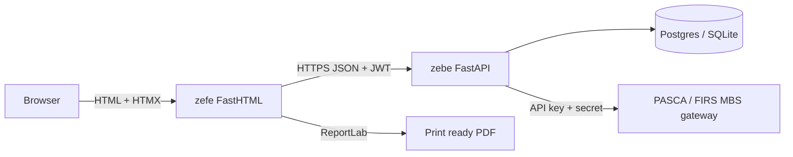
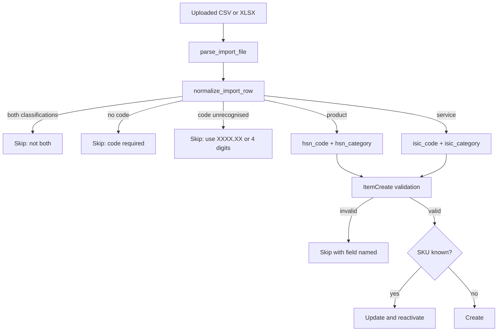
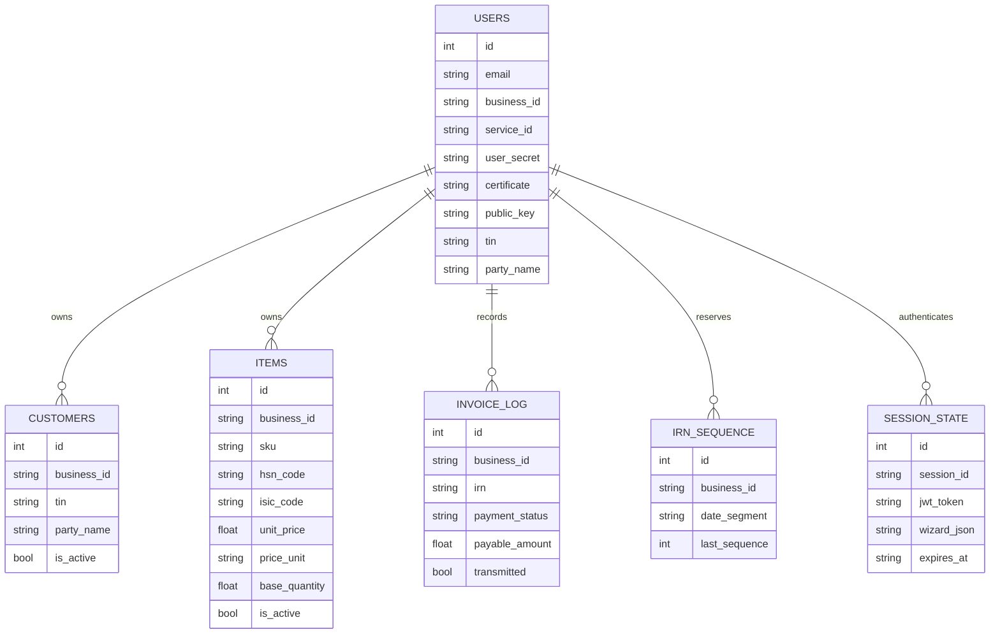
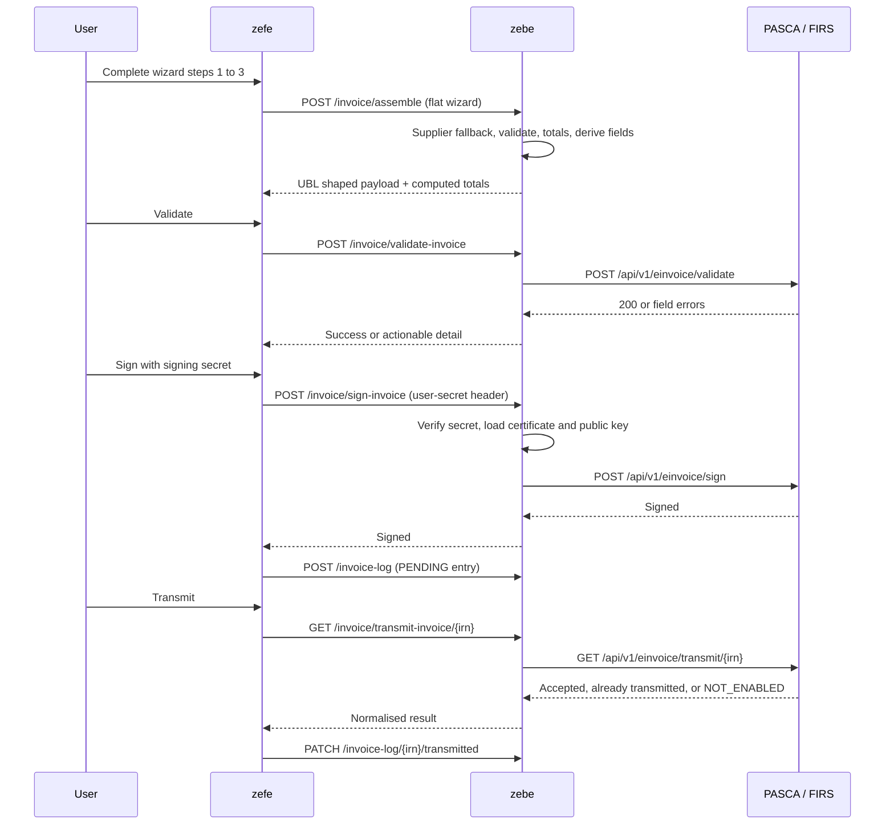

# Zetamind e-Invoicing System Report

This report documents the Zetamind e-invoicing suite as it is implemented
today: the two runtime services, the user experience, every internal and
external endpoint, the schemas and validation rules, the data flow, the
integrations, the deployment notes, and the FIRS / NRS / PASCA constraints the
implementation is built around.

Wording convention: this document, and the user-facing copy in the app, avoid
em dashes and stay concise. The interface keeps a slate and indigo compliance
workbench look: white surfaces, thin 1px slate borders, rounded corners,
indigo accents, flat tables and modals.

---

## 1. Architecture at a glance

Two decoupled services:

| Service | Role | Stack |
| --- | --- | --- |
| `zefe` | Standalone frontend, server rendered HTML, no SPA | FastHTML (Starlette + ASGI), HTMX, Tailwind CSS, ReportLab |
| `zebe` | Stateless API, compliance engine, gateway integrator | FastAPI, SQLAlchemy ORM, Alembic, Postgres or SQLite, JWT |

`zefe` never talks to the FIRS or PASCA gateway. Every outbound compliance
call is made by `zebe`, which owns assembly, validation, signing, transmission
and the local audit log.



### Responsibilities

`zefe`
- Renders every page and partial. HTMX swaps handle modals, filters,
  pagination, lookups and inline row edits, so there is no client framework.
- Holds a browser session cookie (`zefe_session_id`, HTTP only, SameSite Lax)
  and resolves it to a JWT through `zebe`.
- Persists in-progress wizard state as JSON on the server session, so a
  refresh or a new tab resumes the same draft.
- Builds the customer facing PDF from the authoritative JSON returned by
  `zebe`.

`zebe`
- Translates a flat wizard dictionary into the nested UBL 2.1 / Peppol BIS
  Billing 3.0 shaped payload FIRS expects.
- Derives every field that must not be user input: `invoice_kind`,
  `tax_point_date`, `tax_currency_code`, initial `payment_status`, monetary
  totals and the IRN sequence.
- Signs with the business PKI material and transmits to the gateway.
- Owns the customer directory, the reusable items catalog, the IRN sequence
  table and the invoice log.

### Module map

```
app/main/zebe
  main.py                    FastAPI app, CORS, docs auth, lifespan
  auth.py, deps.py           password hashing, JWT, request dependencies
  rate_limiter.py            per business throttle for invoice operations
  routes/
    auth_routes.py           register, token, me, secret, cert, profile
    session_routes.py        browser session create, read, delete, wizard blob
    customer_routes.py       directory CRUD, soft delete, bulk, import
    item_routes.py           catalog CRUD, soft delete, bulk, import
    invoice_routes.py        next-irn, assemble, validate, sign, transmit, qr
    invoice_log_routes.py    audit log and stats
    lookup_routes.py         invoice types, payment means, currencies, geo,
                             unit codes, HS and ISIC search
  services/
    invoice_service.py       assembly, derivation, totals, unit codes, IRN
    import_utils.py          shared CSV and XLSX parsing, row labels, errors
    unit_codes.py            re-export shim over invoice_service
  utils/
    models.py                SQLAlchemy models
    schema.py                Pydantic request and response schemas
    database.py, utility.py  engine, pooled httpx client, retries
  migrations/                Alembic revisions

app/main/zefe
  main.py                    FastHTML app, lifespan, static mount, routes
  endpoints.py               single source of truth for backend paths
  deps.py, config.py         session helpers, environment
  routes/                    auth, dashboard, customers, items, wizard,
                             invoices, settings
  services/                  api_client, auth_service, pdf_service, errors,
                             lookup_service, unit_codes
  ui/                        layout, components, icons
```

---

## 2. UI and UX

### Visual language

- Surfaces: white cards on `slate-50` page background, 1px `slate-200`
  borders, `rounded-lg` and `rounded-xl`, no heavy shadows.
- Accent: indigo for primary actions and active state. Emerald for success,
  amber for reversible warnings such as deactivate, rose for permanent
  destructive actions, sky for informational status.
- Typography: `text-sm` body, `font-semibold` for headings and labels,
  `text-xs text-slate-500` for helper text.
- Every list page shares the same anatomy: header with count and actions,
  guidance panel, filter bar, bulk action bar, flat table, pagination, modal
  area.

### Key screens

| Screen | Purpose | Notable behaviour |
| --- | --- | --- |
| Dashboard | Revenue and status metrics | Stats and recent invoices from the log |
| Customers | Reusable buyer directory | Search, active or inactive filter, deactivate, restore, permanent delete with explicit acknowledgement, CSV or XLSX import |
| Items | Reusable invoice lines | Same anatomy as customers, HS and ISIC lookup, official unit code select, simple import |
| Invoice wizard | Four guided steps | Header, parties, lines, review and sign |
| Invoice detail | Signed invoice view | PDF download, QR, payment status update |
| Settings | Profile, PKI, signing secret | Supplier identity feeds every invoice |

### Wizard stages

1. **Header.** IRN is a read only, system generated block. Dates, invoice
   type, currency and payment means are selected. Credit note, debit note and
   self billed types reveal a required billing reference.
2. **Parties.** Supplier is read only and comes from the business profile.
   Customer is picked from the directory or typed once for a one off invoice.
3. **Line items.** Two non competing ways to add a line. **Add saved item**
   opens a search first picker over the catalog and adds the item as a locked
   line: name, SKU, description, classification, unit code and base quantity
   come from the catalog and stay read only, and only quantity, an invoice
   local unit price override, discount and additional charge are editable.
   **Add one off item** opens manual item details together with the HS / ISIC
   lookup, and that lookup is never shown beside a selected saved item. Every
   row keeps quantity, unit price, discount and additional charge inline as
   none, percent or a fixed amount, with the line total and the invoice totals
   updating on each change.
4. **Review and sign.** A guided lifecycle: validate, sign, transmit,
   finish. Locked stages unlock as the previous one completes. A first time
   user can create the signing secret inline without leaving the wizard.

### PDF

`services/pdf_service.py` renders an A4 document with ReportLab. The invoice
line prints the item name only. The long classification description stays out
of the customer facing document, while the HS or ISIC code keeps its own
column. Totals, status badge, both party blocks and the IRN QR code are
included, with a footer stating the document was verified against the FIRS
gateway using the IRN.

---

## 3. Internal endpoints

All `zebe` routes are mounted under `/api`. Every route except the session
read requires a bearer JWT.

### Auth and session

| Method and path | Purpose |
| --- | --- |
| `POST /auth/register` | Create a business workspace |
| `POST /auth/token` | OAuth2 password grant, returns a JWT |
| `POST /auth/refresh` | Refresh a JWT from a session id |
| `GET /auth/me` | Workspace profile, service id, PKI state |
| `PATCH /auth/me/profile` | Supplier address fields |
| `GET /auth/me/secret`, `PATCH /auth/me/secret` | Signing secret state and update |
| `PATCH /auth/me/cert-key` | Certificate and public key |
| `POST /sessions` | Create a browser session for a JWT |
| `GET /sessions/{session_id}` | Restore session and wizard draft |
| `PATCH /sessions/{session_id}/token`, `/secret`, `/wizard` | Update session parts |
| `DELETE /sessions/{session_id}` | Logout |

### Customers

| Method and path | Purpose |
| --- | --- |
| `GET /customers` | Paginated search, `active` filter |
| `POST /customers` | Create |
| `GET /customers/{id}`, `PATCH /customers/{id}` | Read and update |
| `DELETE /customers/{id}` | Deactivate, `?hard=true` removes the row |
| `POST /customers/{id}/restore` | Reactivate |
| `POST /customers/bulk-delete`, `/bulk-activate` | Bulk soft delete, hard delete, restore |
| `POST /customers/import` | CSV or XLSX import matched on TIN |

### Items catalog

| Method and path | Purpose |
| --- | --- |
| `GET /items` | Search, `kind` product or service, `active` filter |
| `POST /items` | Create, unique `(business_id, sku)` |
| `GET /items/{item_id}`, `PATCH /items/{item_id}` | Read and update |
| `DELETE /items/{item_id}` | Deactivate, `?hard=true` removes the row |
| `POST /items/bulk-delete`, `/bulk-activate` | Bulk operations |
| `POST /items/import` | Simple CSV or XLSX import, see section 5 |

### Invoices and log

| Method and path | Purpose |
| --- | --- |
| `POST /invoice/next-irn` | Reserve the next compliant IRN |
| `POST /invoice/validate-irn` | Check the IRN against the business template |
| `POST /invoice/assemble` | Flat wizard to UBL shaped payload plus totals |
| `POST /invoice/validate-invoice` | Gateway schema validation |
| `POST /invoice/sign-invoice` | Sign with the business PKI material |
| `GET /invoice/transmit-invoice/{irn}` | Transmit the signed invoice |
| `GET /invoice/get-invoice/{irn}` | Fetch a stored invoice |
| `PATCH /invoice/update-invoice/{irn}` | Payment status update |
| `GET /invoice/{irn}/qr` | Base64 QR image |
| `GET /invoice-log`, `/invoice-log/stats`, `POST /invoice-log` | Audit log |
| `PATCH /invoice-log/{irn}/transmitted`, `/status` | Local flags |

### Lookups

`/lookup/types-of-invoice`, `/lookup/payment-means`, `/lookup/get-currency`,
`/lookup/tax-categories`, `/lookup/state-codes`, `/lookup/lga-codes`,
`/lookup/countries`, `/lookup/unit-codes`, `/lookup/products`,
`/lookup/services`.

---

## 4. External endpoints and integrations

`zebe` is the only caller of the upstream gateway. Requests carry
`API-KEY` and `API-SECRET` headers and go through a pooled `httpx.AsyncClient`
with retries on transport errors.

| Upstream call | Used by |
| --- | --- |
| `POST /api/v1/einvoice/irn/validate` | `POST /invoice/validate-irn` |
| `POST /api/v1/einvoice/validate` | `POST /invoice/validate-invoice` |
| `POST /api/v1/einvoice/sign` | `POST /invoice/sign-invoice` |
| `GET /api/v1/einvoice/transmit/{irn}` | `GET /invoice/transmit-invoice/{irn}` |
| `GET /api/v1/einvoice/{irn}` | `GET /invoice/get-invoice/{irn}` |
| `PATCH /api/v1/einvoice/update/{irn}` | `PATCH /invoice/update-invoice/{irn}` |

Environment base URLs are configuration, not code: `PASCA_BASE_URL` for the
gateway and `BASE_URL` for the reference service. Sandbox and production are
selected purely by these values.

Upstream failures are translated into actionable local errors:

- `401` or `403` becomes a credentials message pointing at Settings.
- Any body containing `NOT_ENABLED` becomes a recipient enablement message.
- `400`, `404`, `409`, `422` keep their status and the extracted detail.
- Anything else becomes `502` with the extracted detail.
- A transmit response that says already transmitted or duplicate is treated as
  success, so a retry is idempotent from the user point of view.

---

## 5. Items import: simple codes, detected classification

Users upload the simple layout:

```
sku, name, description, code, unit_price, price_unit, base_quantity
```

Detection happens in `routes/item_routes.py`:

- `code` matching `XXXX.XX` is a product, stored as `hsn_code` with
  `hsn_category`.
- `code` matching exactly four digits is a service, stored as `isic_code`
  with `isic_category`.
- Anything else is rejected with a row level reason naming `code`.

Category resolution, in order: an explicit `category` column (or any of
`hsn_category`, `isic_category`, `product_category`, `service_category`), then
the item name, then the description. The chosen label is trimmed to one clause
and capped at 60 characters, so invoice lines and outbound payloads stay
readable.

The older detailed layout keeps working. If `hsn_code` or `isic_code` is
supplied directly, it is used as is. Supplying both is rejected.

Remaining rules are enforced by `ItemCreate`, so there is a single source of
truth and no schema churn:

| Rule | Failure message names |
| --- | --- |
| Official 2 to 3 character UN/ECE unit code | `price_unit` |
| `unit_price > 0` | `unit_price` |
| `base_quantity > 0` | `base_quantity` |
| Exactly one classification | `code` |
| HS format `XXXX.XX`, ISIC exactly four digits | `hsn_code` or `isic_code` |
| Category present for the detected kind | `hsn_category` or `isic_category` |

Every failure skips one row, records `Row N [SKU or name]: reason`, and the
import continues. The response is
`{"created": n, "updated": n, "skipped": n, "errors": [...]}` with at most 100
reasons. Rows are matched on SKU inside the workspace, so a known SKU is
updated and reactivated.



The customer import mirrors this shape with the columns
`tin, party_name, email, telephone, street_name, city_name, postal_zone,
country, state, lga`, matched on TIN, and shares
`services/import_utils.py` for parsing, row labels and error formatting.

---

## 6. Schemas

### Persistence



Constraints worth noting: `uq_items_business_sku`,
`uq_invoice_log_business_irn`, `uq_irn_sequence_business_date`. Customers and
items are soft deleted with `is_active`, so removing one never rewrites
invoice history or breaks a pending draft.

### Outbound invoice payload

`InvoiceSchema` is the wire contract. Every field keeps its snake_case name.
Routes serialize with
`model_dump(exclude_none=True, by_alias=True, mode="json")` through one
helper, `_outbound_invoice_payload`, which asserts required wire fields are
present and forbidden spellings are absent.

Top level: `irn`, `business_id`, `invoice_kind`, `issue_date`, `issue_time`,
`due_date`, `tax_point_date`, `payment_status`, `invoice_type_code`,
`document_currency_code`, `tax_currency_code`, `billing_reference`,
`payment_means`, `accounting_supplier_party`, `accounting_customer_party`,
`tax_total`, `legal_monetary_total`, `invoice_line`.

Party: `tin`, `email`, `telephone`, `party_name`, `postal_address` with
`street_name`, `city_name`, `postal_zone`, `country`, `state` and optional
`lga`. Blank `lga` is omitted rather than sent empty.

Line: `item` with `name`, optional `description` and
`sellers_item_identification`; `price` with `price_amount`, `base_quantity`
and `price_unit`; `invoiced_quantity`; `line_extension_amount`; exactly one of
`hsn_code` plus `product_category` or `isic_code` plus `service_category`;
optional `discount_rate`, `discount_amount`, `fee_rate`, `fee_amount`.

---

## 7. Validation and derivation

Nothing that can be derived is asked for.

| Field | Derived from |
| --- | --- |
| `invoice_kind` | Customer TIN present means `B2B`, otherwise `B2C` |
| `tax_point_date` | `issue_date`, normalised to `YYYY-MM-DD` |
| `tax_currency_code` | Always `NGN` |
| `payment_status` | Always `PENDING` at creation |
| `issue_time` | Server clock at assembly |
| Monetary totals | Line extensions plus 7.5 percent VAT |
| IRN sequence | `irn_sequence` table, floored by the invoice log |

Structural validation in `validate_wizard` covers the IRN pattern and its date
segment, issue and due date ordering, required billing reference for types
`380`, `384` and `385`, currency and payment means, both parties with FIRS TIN
format `NNNNNNNN-NNNN`, valid email, complete address, and per line rules for
classification, quantity, price, unit code and base quantity.

`validate_totals_consistency` recomputes the subtotal from the lines, the VAT
at 7.5 percent, and the payable amount, and rejects any drift greater than
0.01 or a negative total.

Line adjustment maths: `base = quantity * unit_price`, then
`line_extension = base - discount + fee`, where a percent rate is applied to
`base` and a flat amount is used verbatim.



---

## 8. Data flow and session model

1. Login posts credentials to `zefe`, which requests a JWT from `zebe`.
2. `zefe` creates a server session through `POST /sessions` and sets the
   `zefe_session_id` cookie. Sessions expire after eight hours.
3. Each request resolves the cookie to a JWT. A `401` from `zebe` triggers one
   silent refresh through `POST /auth/refresh`, then the call is retried.
4. Wizard progress is stored as `wizard_json` on the session row, so the draft
   survives refreshes and is cleared on finish or discard.
5. Reading a signed invoice always goes back to `zebe`, which enforces that
   the invoice belongs to the caller business before returning it.

---

## 9. Security

- Cookies are HTTP only, Secure and SameSite Lax. No token is stored in
  client side JavaScript.
- The signing secret is verified against a hash and is never persisted in the
  browser. It is sent only as the `user-secret` header on sign and status
  update calls.
- PKI material stays server side and is attached to the signing payload by
  `zebe`.
- Invoice operations are throttled per business by `rate_limiter`.
- Cross tenant reads are blocked: every query is scoped by `business_id`, and
  an invoice whose `business_id` does not match the caller is refused.
- API docs are disabled in production and basic auth protected otherwise.
- CORS allows only the configured frontend origin.

---

## 10. Deployment notes

`zebe` environment:

```
JWT_SECRET_KEY, ALGORITHM, ACCESS_TOKEN_EXPIRE_IN_MINUTES
API_KEY, CLIENT_SECRET
PASCA_BASE_URL, BASE_URL
DATABASE_URL
FRONTEND_URL, ENVIRONMENT
DOCS_USERNAME, DOCS_PASSWORD
```

`zefe` environment:

```
BACKEND_URL, SESSION_SECRET, HOST, PORT
```

Start order:

1. Install dependencies for both services.
2. Apply migrations and seed defaults for `zebe`, then run the API on port
   8000.
3. Run `zefe` on port 5000 with `BACKEND_URL` pointing at the API.

Schema changes go through Alembic. Any new column must be nullable or carry a
default, because the tables already hold rows. Both services ship a
`Dockerfile`, so each scales independently behind a reverse proxy that
terminates TLS.

Regression checks live in `app/main/smoke_tests.py` and run without pytest or
network access:

```
python -m app.main.smoke_tests
```

They force an isolated SQLite database before any backend import, guard the
`zefe` to `zebe` client contract, exercise the item API end to end including
the simple import, and assert the wording, stage 3, PDF and outbound payload
guardrails described in this report.

---

## 11. FIRS, NRS and PASCA constraints

Constraints the implementation encodes today:

- **IRN pattern.** `INV{sequence}-{ServiceID}-{YYYYMMDD}`. The service id is
  normalised to at most 12 alphanumeric characters. The date segment must
  match `issue_date`, and assembly rejects a mismatch. Sequences start at 3180
  and are reserved per business and per day, floored by the highest sequence
  already in the invoice log, then advanced past any local collision.
- **business_id.** Passed through byte exact as the lowercase UUID, because
  gateway templates are registered against it. Only whitespace is stripped.
- **tax_currency_code.** Required on every invoice and accepted only in
  snake_case. The camelCase spelling was rejected by the sandbox with
  `invoicerequest.invoice.taxcurrencycode is required`, so it is now a
  forbidden wire field asserted centrally.
- **VAT.** Standard rate 7.5 percent, always reported in NGN whatever the
  document currency is. VAT is computed on the net amount, never on the gross.
- **Invoice types.** `380`, `381`, `384`, `385`. The staging platform reverses
  the global labels for `380` and `381`, so the type list is always read from
  the lookup endpoint rather than hard coded semantics. Types `380`, `384` and
  `385` require the original IRN and issue date as a billing reference.
- **Classification.** Every line is either a product with an HS code in
  `XXXX.XX` form and a product category, or a service with a four digit ISIC
  code and a service category. Never both.
- **Unit codes.** `price_unit` must be an official 2 to 3 character UN/ECE
  code. The accepted set is EA, KGM, MTR, LTR, MTK, MTQ, HUR, DAY, BOX, BAG,
  BTL, CTN, SET. Free text such as `NGN per 1` is rejected and the legacy
  `C62` code was removed. `EA` is the single default.
- **TIN format.** `NNNNNNNN-NNNN` for both parties.
- **Address.** Street, city, postal zone, country and state are required. LGA
  is optional, and a blank value is omitted rather than sent empty.
- **Immutability.** Once signed, an invoice cannot be edited. A correction is
  a new document with a fresh IRN and a billing reference to the original.
- **Recipient enablement.** Transmission fails with `NOT_ENABLED` when the
  buyer has not enabled e-invoice receiving. This is surfaced as an actionable
  message, not a server error.
- **Duplicate IRN.** Handled by the server owned sequence and by treating an
  already transmitted response as success.
- **Timeliness.** B2B and B2G invoices are expected in real time at issuance;
  B2C reporting has a wider window. The lifecycle in the wizard is designed to
  validate, sign and transmit in one sitting.
- **Signing material.** Certificate and public key must be stored complete,
  including the PEM header and footer lines.

Constraints noted from published guidance that the current implementation does
not depend on, and that would be additive work:

- `invoice_kind` values `B2G` and `G2B` are accepted by the schema but are not
  derived today; only `B2B` and `B2C` are produced.
- A dedicated confirm and download step, plus signed XML retrieval, is not
  wired. The app relies on validate, sign, transmit and the local log.
- Gateway rate limits are not published, so the client uses conservative
  retries and a local per business throttle instead.
